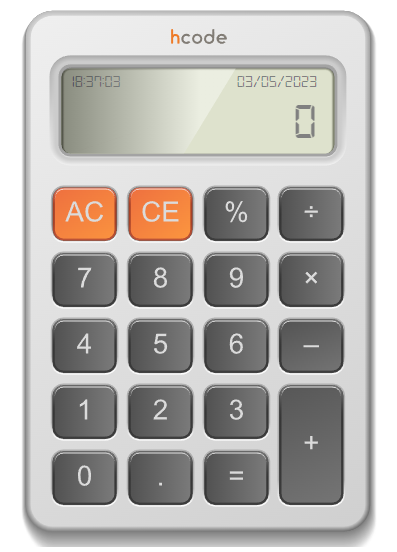

# Calc-2.0
## Descrição do Projeto:
- Outro projeto de calculadora, dessa vez o foco maior é o código.
- O projeto é uma calculadora desenvolvida utilizando JavaScript, HTML e CSS. A calculadora possui as operações básicas de soma, subtração, multiplicação e divisão.
- O projeto também inclui validações para garantir que os valores inseridos estejam no formato correto, além de tratar erros que possam ocorrer durante a execução.

## Tecnologias usadas
- JavaScript: para as operações matemáticas.

## Como Usar
- Faça o download ou clone o reposítório;
- Abra o aplicativo em um navegador da web;
- Faça suas contas;

## Autor
- Eu :), com ajuda de um curso oferecido por hcode
- O conteúdo visual, html, css, além de algumas configurações foi fornecido pelo curso da Hcode, o código foi desenvolvido em conjunto com as aulas desse curso.

